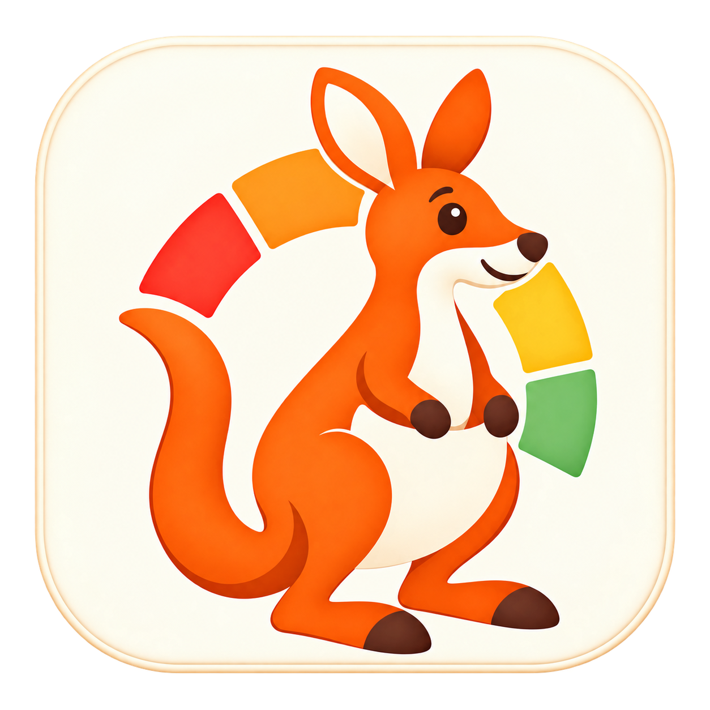

<p align="center">
<picture>
  <source media="(prefers-color-scheme: dark)" srcset="design/logo/token-watchroo-logo-dark.png">
  <source media="(prefers-color-scheme: light)" srcset="design/logo/token-watchroo-logo.png">
  
</picture>
</p>

<h1 align="center">Token Watchroo</h1>

<p align="center"><strong>TokenWatchroo - Track your tokens. Get warned before they run out.</strong></p>

<p align="center">
  <a href="https://github.com/kevin-lee/token-watchroo/actions/workflows/build.yml" /></img>
  <a href="https://github.com/kevin-lee/token-watchroo/actions/workflows/release.yml" /></img>
  
</p>


A macOS menubar app that shows how much of each AI agent's usage window you have used and warns you before a window runs out. The ring in the menubar fills with the highest usage across your agents. Click it for a card per agent with session and weekly windows, per-model weekly windows for Claude Code, percentages, and reset times. Notifications fire once at 80% and once at 95% of a window, and once more when the window resets.

All business logic is Scala 3 compiled by Scala Native into a static library. A small Swift shell hosts it and owns the menubar item, the menu, notifications, and timers. There is **NO JVM at runtime**.


## Features (v1)

- Agents: Claude Code (subscription plan) and Codex (ChatGPT plan), auto-detected from the credentials the CLIs already store. No sign-in inside the app.
- Menubar ring with four states: normal, warning at 80% (amber), critical at 95% (red), and exhausted (time until reset).
- A card per agent: plan badge (for Claude Code the live plan with the Max multiplier or the Team seat, such as "Max 5x" or "Team Premium"), status pill, session and weekly bars, one more bar per model-specific weekly window on Claude Code (for example "Weekly (Fable)"), reset countdowns in your local time zone.
- System notifications, deduplicated per window so a restart never repeats one.
- An app icon with light and dark appearances on macOS 26 (the dark one with the Dark icon style, light only on macOS 14 and 15), and a ring thumbnail on every notification showing the alert's percent.
- Codex keeps working offline from its local rollout logs when the usage endpoint fails.
- Menu items: Refresh now, Launch at Login, Quit.

## Limitations (v1)

- The usage endpoints are undocumented and may change. When they do, the card says "Unexpected response" instead of crashing.
- The app never refreshes tokens. When a token expires, run `claude` or `codex` once and the card recovers on the next refresh.
- A build from source is ad-hoc signed, so macOS asks to allow keychain access again after each rebuild. Click "Always Allow" once per build. Releases are Developer ID signed and notarized, so an upgrade does not ask again.
- No settings window, thresholds fixed at 80% and 95%, refresh every 60 seconds.
- Cursor, Gemini CLI, and API-budget agents are on the roadmap in `.ai/docs/design/token-watchroo-design.md`.

## Requirements

- macOS 14 or later on Apple Silicon or Intel. A build from source is host-architecture only.
- Xcode command line tools with Swift 6 (`swift build`).
- JDK 17 or later and sbt 2 for the build only. LLVM/Clang from Xcode is used by Scala Native.
- Full Xcode 26 only to regenerate the app icon (`scripts/generate-icons.sh` uses actool). The build itself needs the Command Line Tools only.
- Claude Code and/or Codex signed in on this machine.

## Install

### Homebrew (recommended)

```bash
brew install --cask kevin-lee/tap/token-watchroo
```

Or tap first, then install:

```bash
brew tap kevin-lee/tap
brew install --cask token-watchroo
```

Upgrade with `brew upgrade --cask token-watchroo`. Uninstall with `brew uninstall --cask token-watchroo`, and add `--zap` to remove the state directory too.

### Disk image

Download `Token-Watchroo-<version>-arm64.dmg` (Apple Silicon) or `Token-Watchroo-<version>-x64.dmg` (Intel) from the [Releases](https://github.com/kevin-lee/token-watchroo/releases) page, open it, and drag Token Watchroo to Applications. The builds are Developer ID signed and notarized, so macOS opens them without a Gatekeeper step.

### From source

```bash
sbt tokenWatchroo/bundleApp
open "dist/Token Watchroo.app"
```

`sbt tokenWatchroo/runApp` does both. The app appears in the menubar, not in the Dock.

`bundleApp`, `runApp`, `swiftTest`, and the `buildApp` alias (`bundleApp`) are defined only on the root project, `tokenWatchroo`. The `sbt` command connects to a running sbt server, and that server remembers its current project between commands. After `sbt "project core"` (or any other module), `sbt buildApp`, `sbt bundleApp`, and `sbt runApp` fail with "Not a valid command". Either prefix the task with `tokenWatchroo/` as above, or switch the server back once with `sbt "project tokenWatchroo"`. `sbt projects` marks the current project with `*`.

## Build and test

Scala Native picks the Garbage Collector (GC) yieldpoint mode at link time from `SCALANATIVE_GC_TRAP_BASED_YIELDPOINTS`, and the 0.5.12 GC loses a root of a thread stopped by a trap-based yieldpoint, the release default, and frees live objects (#44, upstream [scala-native/scala-native#5046](https://github.com/scala-native/scala-native/issues/5046)). Every binary is therefore linked with conditional yieldpoints, and the build refuses to load unless the variable is `0` in the environment of the process that starts the sbt server. Nothing inside the build can set it, and that includes the server Metals starts.

```bash
# in the shell profile, so that every sbt server inherits it
export SCALANATIVE_GC_TRAP_BASED_YIELDPOINTS=0

# a server started without it has to go, and a target linked in the other mode never relinks for the variable
sbt --client shutdown
rm -rf target/out/native0.5/scala-3.8.4/*/native target/out/native0.5/scala-3.8.4/*/native-test
sbt
```

`stageNativeLib` checks the archive with `scripts/check-yieldpoints.sh` before staging it, so `bundleApp`, `runApp` and `swiftTest` fail on a trap-linked archive, and `sbt checkYieldpoints` checks the three test binaries, as the workflows do. `TW_ALLOW_TRAP_YIELDPOINTS=1` opts out of the load check and the archive gate for experiments that need a trap build. The variable, the checks and the script go together when a Scala Native release fixes #5046.

On x86 and x86_64 the 0.5.12 GC never saves the callee-saved registers of a thread that goes Unmanaged, because `RegistersCapture` takes its buffer by value, so an object that only a register refers to can be freed while in use (#63, upstream [scala-native/scala-native#5048](https://github.com/scala-native/scala-native/pull/5048)). `native-overrides/scala-native-0.5.12/` holds a patched copy of that header, and `build.sbt` puts it on the C include path ahead of Scala Native's own. `stageNativeLib` checks the archive with `scripts/check-registers-capture.sh`, and `sbt checkRegistersCapture` checks the three test binaries, as the workflows do. Scala Native recompiles a C file only when that file or the build configuration changes, so after editing the copy remove the `native` and `native-test` folders as above before relinking. The build refuses another Scala Native version until the copy is compared with that version's header. The copy, the option, the checks and the script go together when a Scala Native release includes scala-native/scala-native#5048.

```bash
# core: hedgehog property tests on Scala Native
sbt core/test

# providers and app: munit on Scala Native
sbt providers/test
sbt app/test

# Swift shell: XCTest against the staged static library
sbt tokenWatchroo/swiftTest

# the static library only
sbt app/nativeLink

# stage the library, build the Swift shell, assemble and sign the bundle (ad-hoc unless TW_SIGNING_IDENTITY is set)
sbt tokenWatchroo/bundleApp

# assemble and open
sbt tokenWatchroo/runApp

# regenerate the app icon (needs Xcode 26), outputs are committed
scripts/generate-icons.sh
```

Set `TW_NETWORK_TESTS=1` to include the libcurl smoke test against example.com.

To test a sign-out without signing out of Claude Code or Codex, launch a local build with `TW_DEBUG_CLAUDE_SIGNED_OUT_FILE` set to an absolute file path. While that file holds `signed-out`, Claude Code reads as not signed in and the keychain is not read. For Codex, point `CODEX_HOME` at a folder without `auth.json`, for example `open --env TW_DEBUG_CLAUDE_SIGNED_OUT_FILE=/tmp/tw/claude --env CODEX_HOME=/tmp/tw/codex "dist/Token Watchroo.app"`.

To test the logs without a real failure, set `TW_DEBUG_ENVELOPES_FILE` to an absolute file path: every refresh passes each line of that file to the shell as an envelope, so a broken or stale envelope is logged as dropped. While the file named by `TW_DEBUG_ENTRY_FAILURE_FILE` holds `fail`, a refresh fails inside the library and the failure is written to the log file.

For example, with scratch files under `/tmp/tw`:

```bash
mkdir -p /tmp/tw/codex
printf 'signed-out\n' > /tmp/tw/claude
printf '%s\n' \
  '{"version":1,"type":"snapshot","seq":1000000000,"data":{"updatedAt":1}}' \
  '{"version":1,"type":"snapshot","seq":0,"data":{"updatedAt":1,"menubar":{"kind":"unavailable"}}}' \
  > /tmp/tw/envelopes
printf 'ok\n' > /tmp/tw/entry-failure

open \
  --env TW_DEBUG_CLAUDE_SIGNED_OUT_FILE=/tmp/tw/claude \
  --env CODEX_HOME=/tmp/tw/codex \
  --env TW_DEBUG_ENVELOPES_FILE=/tmp/tw/envelopes \
  --env TW_DEBUG_ENTRY_FAILURE_FILE=/tmp/tw/entry-failure \
  "dist/Token Watchroo.app"

# Claude Code signs out and back in on the next refresh
printf 'signed-out\n' > /tmp/tw/claude
printf 'signed-in\n' > /tmp/tw/claude

# the next "Refresh now" fails inside the library, then works again
printf 'fail\n' > /tmp/tw/entry-failure
printf 'ok\n' > /tmp/tw/entry-failure

# stop injecting envelopes without deleting the file
: > /tmp/tw/envelopes
```

With these files, every refresh logs an undecodable body (seq 1000000000) and a stale `seq` (seq 0) under the subsystem, as shown in [Logs](#logs).

## Logs

The app logs under the subsystem `io.kevinlee.tokenwatchroo`. In zsh `log` is a builtin, so spell out `/usr/bin/log`:

```bash
# the last hour
/usr/bin/log show --last 1h --predicate 'subsystem == "io.kevinlee.tokenwatchroo"'

# live
/usr/bin/log stream --level info --predicate 'subsystem == "io.kevinlee.tokenwatchroo"'
```

Console shows the same lines when filtered by that subsystem.

The bundled app, started with `open` or from Finder, also keeps its stderr in `~/Library/Logs/Token Watchroo/token-watchroo.log`, including the errors of the Scala Native library. At launch a file above 1 MiB is moved to `token-watchroo.log.1`. A build run from a terminal keeps stderr on the terminal.

## App icon

The sources are the kangaroo artwork under `design/logo/`: `token-watchroo-logo.png` for the light appearance and `token-watchroo-logo-dark.png` for the dark one. `design/AppIcon.icon` is an Icon Composer package (it opens in Icon Composer from Xcode 26) that uses both PNGs as one layer specialised per appearance. `scripts/generate-icons.sh` resizes the sources into the package and compiles it with actool into `assets/Assets.car` and `assets/AppIcon.icns`. Both files are committed and `sbt bundleApp` only copies them into the bundle, so a normal build needs no Xcode. On macOS 26 the dark kangaroo appears when System Settings > Appearance > "Icon & widget style" is set to Dark (or to Automatic, at night). With the Default style the light kangaroo stays even in Dark Mode, which is how macOS 26 treats every app icon. macOS 14 and 15 always show the light one from the `.icns`.

## Release

### Local signed build

`scripts/bundle-app.sh` signs with hardened runtime and a timestamp when `TW_SIGNING_IDENTITY` names a Developer ID Application identity in the login keychain, and ad-hoc signs otherwise. Notarization uses an App Store Connect API key. The app is notarized and stapled first, then the disk image built from it, so both validate offline.

```bash
export TW_SIGNING_IDENTITY="Developer ID Application: <name> (<team>)"
sbt bundleApp

export APPLE_API_KEY_P8_PATH=/path/to/AuthKey_<KEYID>.p8
export APPLE_API_KEY_ID=<KEYID>
export APPLE_API_ISSUER_ID=<ISSUER-UUID>
scripts/notarize.sh "dist/Token Watchroo.app"
scripts/make-dmg.sh "dist/Token Watchroo.app" dist
scripts/notarize.sh dist/Token-Watchroo-<version>-arm64.dmg

# after stapling, which rewrites the image
scripts/checksum.sh dist/Token-Watchroo-<version>-arm64.dmg

# manual tap update in a checkout of kevin-lee/homebrew-tap
scripts/update-cask.sh <version> <arm64-sha256> <x64-sha256> <tap-checkout>
```

### Continuous integration

`.github/workflows/build.yml` runs on pull requests and on pushes to `main`: the tests, an ad-hoc bundle, and a zipped bundle artifact.

`.github/workflows/release.yml` runs on a `vX.Y.Z` tag:

```bash
git tag v0.1.0
git push origin v0.1.0
```

The release note comes from `changelogs/<version>.md`, so that file has to exist before the tag is pushed: the build job checks for it before anything is signed.

It runs the tests, builds a signed and notarized DMG per architecture on `macos-26` and `macos-26-intel`, verifies each image (Developer ID signature, hardened runtime, Gatekeeper, stapled ticket, architecture, checksum), creates the GitHub release with the DMGs, their `.sha256` files, and `changelogs/<version>.md` followed by the generated notes, then pushes the cask to `kevin-lee/homebrew-tap` and keeps the previous version as `token-watchroo@<previous>`. The release fails, and nothing is published, when a secret is missing.

### Secrets

| Secret | Value |
|---|---|
| `APPLE_CERTIFICATE_P12` | base64 of the Developer ID Application certificate exported as `.p12` |
| `APPLE_CERTIFICATE_PASSWORD` | the password chosen at export |
| `APPLE_API_KEY_P8` | base64 of the App Store Connect API key `.p8` |
| `APPLE_API_KEY_ID` | its Key ID |
| `APPLE_API_ISSUER_ID` | the Issuer ID of the team |
| `HOMEBREW_TAP_TOKEN` | fine-grained token with Contents read and write on `kevin-lee/homebrew-tap` |

Obtaining them:

1. Certificate: Keychain Access, My Certificates, the Developer ID Application identity with its private key, Export as `.p12` with a password.
2. API key: App Store Connect, Users and Access, Integrations, App Store Connect API, Team Keys, Generate API Key with the Developer role, download the `.p8` (offered once), note the Key ID and the Issuer ID.
3. Tap token: GitHub Settings, Developer settings, Fine-grained personal access tokens, repository access `kevin-lee/homebrew-tap` only, Contents read and write.
4. Store them:

```bash
gh secret set APPLE_CERTIFICATE_P12 --body "$(base64 -i DeveloperID.p12)"
gh secret set APPLE_CERTIFICATE_PASSWORD
gh secret set APPLE_API_KEY_P8 --body "$(base64 -i AuthKey_<KEYID>.p8)"
gh secret set APPLE_API_KEY_ID --body "<KEYID>"
gh secret set APPLE_API_ISSUER_ID --body "<ISSUER-UUID>"
gh secret set HOMEBREW_TAP_TOKEN
```

## Architecture

```
┌──────────────────────────────── Token Watchroo.app ────────────────────────────────┐
│                                                                                    │
│  Swift shell (swift/)                    Scala Native static library (modules/)    │
│  ┌──────────────────────────┐            ┌────────────────────────────────────┐    │
│  │ main thread              │  tw_start  │ token-watchroo-app                 │    │
│  │  NSStatusItem + ring     │──────────► │  exported C API, cats-effect       │    │
│  │  NSMenu + agent cards    │  tw_refresh│  runtime, poll loop, alert state   │    │
│  │  UNUserNotificationCenter│  tw_shutdown                                    │    │
│  └──────────▲───────────────┘            └──────┬────────────────┬────────────┘    │
│             │ callback (JSON envelope)          │                │                 │
│             └───────────────────────────────────┘                │                 │
│                                          ┌───────────────────────▼────────────┐    │
│                                          │ token-watchroo-providers           │    │
│                                          │  keychain, auth.json, libcurl,     │    │
│                                          │  Claude Code and Codex providers   │    │
│                                          └───────────────────────┬────────────┘    │
│                                          ┌───────────────────────▼────────────┐    │
│                                          │ token-watchroo-core (Native)       │    │
│                                          │  domain model, thresholds, alert   │    │
│                                          │  engine, JSON codecs, parsers      │    │
│                                          └────────────────────────────────────┘    │
└────────────────────────────────────────────────────────────────────────────────────┘
```

| Module | Platform | What it holds |
|---|---|---|
| `modules/token-watchroo-core` | Scala Native, pure | Domain types (refined4s newtypes, Scala 3 enums), status and menubar rules, the alert engine, ISO-8601 parsing, notification copy, jsoniter-scala codecs, the Codex rollout parser. Tested with hedgehog on Scala Native. |
| `modules/token-watchroo-providers` | Scala Native | Keychain reader (`/usr/bin/security`), `auth.json` reader, libcurl HTTP client, the Claude Code and Codex providers. Tested with munit. |
| `modules/token-watchroo-app` | Scala Native static library | The exported C API (`tw_start`, `tw_refresh`, `tw_set_config`, `tw_shutdown`), the cats-effect runtime, the poll loop, state persistence. Tested with munit. |
| `swift/` | Swift 6 package | `NSStatusItem`, `NSMenu` with custom card views, notifications, Launch at Login. Renders what the library sends. |
| `assets/` | committed build inputs | `Assets.car` and `AppIcon.icns` generated by `scripts/generate-icons.sh`. |
| `scripts/` | shell | `bundle-app.sh`, `notarize.sh`, `make-dmg.sh`, `ci-import-certificate.sh`, `update-cask.sh`, `generate-icons.sh`. |
| `.github/workflows/` | GitHub Actions | `build.yml` (tests and an ad-hoc bundle on pull requests and `main`), `release.yml` (signed, notarized DMGs, the GitHub release, the cask). |

The full design, including the threading and garbage-collector contract between Swift and Scala Native, the JSON contract, and the roadmap, is in `.ai/docs/design/token-watchroo-design.md`.

## Credentials and privacy

- Claude Code: the app reads the `Claude Code-credentials` keychain item through `/usr/bin/security`, the same way TokenEater and CodexBar do, calls `https://api.anthropic.com/api/oauth/usage` with that token, and calls `https://api.anthropic.com/api/oauth/profile` for the plan badge at most once an hour and on Refresh now.
- Codex: the app reads `~/.codex/auth.json` (or `$CODEX_HOME/auth.json`) and calls `https://chatgpt.com/backend-api/wham/usage`. When that fails it reads the newest log under `~/.codex/sessions`.
- Nothing is written back to those files or to the keychain. Tokens never appear in logs or on cards.
- The only file the app writes is `~/Library/Application Support/Token Watchroo/state.json`, which remembers which notifications already fired.
- No telemetry, no accounts, no other network calls.

## License

MIT. See `LICENSE`.
